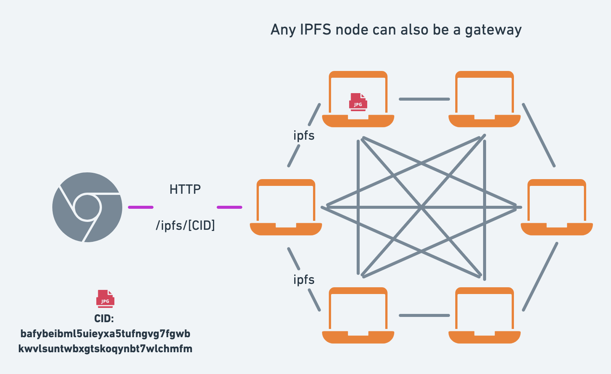

# Break on Through with IPFS HTTP Gateways

<!--
## Outline

- What is IPFS?
  - Definition
  - Concepts
    - CID
    - Peer to peer
    - Resilience - can’t be shut down
    - Easier caching with CID
  - Use-cases
    - Reading public data, e.g. NFTs
  - IPFS and the WWW
    - client-Server vs peer to peer
    - Trust
      - TLS: Certificates & encryption
      - Self verifiability
- Fetching data from IPFS
  - Low level vs high-level cloud services
    - Server, linux, nginx vs AWS S3/Cloudfront
    - IPFS Node vs Gateway
  - Fetching data from the network
    - How to use IPFS gateways
    - Public gateways
  - Resolution styles -->

The Interplanetary File System (IPFS) is a peer-to-peer protocol for storing and accessing files and websites. As distributed **peer-to-peer** protocol, it's fundamentally different from the HTTP protocol that forms the foundation for the internet.

<!-- Because files are at the heart of the internet and the internet is at the heart of everything, the potential use cases for IPFS are endless. -->

IPFS is a relatively new protocol compared to the time-honored HTTP protocol and isn't feasible for use in every scenario. The good news is that with the help of IPFS HTTP gateways, you can tap into the IPFS network directly from any browser.

This blog post will give an overview of the core concepts of the IPFS protocol, discuss the relationship between IPFS and HTTP(S), the role of IPFS gateways, and demonstrate how you can consume data from the IPFS network using HTTP without running any IPFS infrastructure.

If you're already familiar with the concepts of IPFS and would like to learn how to use IPFS gateways feel free to skip ahead to the [practical example](#TODO) section.

> Note: The blog post uses HTTP to refer to both HTTP and HTTPS for brevity and assumes that HTTPS should be used in every production application.

## The challenges with the client-server model

Typically, when you access a website, your browser uses several protocols to load the website:

- First, DNS is used by your browser to find the IP address of the server.
- Second, HTTP is used to request the website from the server.

Such interactions are characterized by the **client-server** model whereby your browser is a client interacting with an HTTP and DNS server.

While the client-server model has been the predominant model for the internet, it is fundamentally centralized and comes at the cost of resilience, reliance on gatekeepers, and single points of failure.

Practically speaking, a common challenge with the client-server model is that it puts all responsibility to ensure the availability of content on the server operator.

For example, when you open the following [URL of an image of Astronaut Jessica Watkins](https://www.nasa.gov/sites/default/files/thumbnails/image/04_iss067e033423.jpg) from the NASA website, you rely on the NASA server(s) being up.

When the server is down or unreachable, you won’t be able to access the image.

Moreover, the HTTP protocol does not specify a way to **ask other servers** for the image so the file is only available as long as the origin server hosts it.

> Note: In reality most websites rely on multiple servers that are load balanced to ensure high availability of content. But solutions to ensure high availability are not standardised as part of the HTTP protocol and are typically opaque to clients.

## From client-server to peer-to-peer with IPFS

One of the core characteristics of the IPFS is that it is a peer-to-peer network. In contrast to the client-server model where you typically have many clients consuming from a single server, with the peer-to-peer model, every computer (typically referred to as a _peer_) in the IPFS network can wear both the hat of a server and a client. This means that every IPFS peer can become a productive member of the network.

> Note: The article uses the terms **peer** and **node** interchangeably to refer to computers running the IPFS software.

As illustrated in the diagram, instead of relying on a single server at the center of the network that clients connect to, each peer connects to multiple peers. Since the `jpg` file is stored on three of the peers, two of those three nodes can be down and the file will still be accessible to the network. What's more, any number of peers become a provider for the `jpg` file, once they download it from the network.

In summary, with IPFS, nodes pool their resources, e.g., internet connection and disk space, and ensure that the availability of files is **resilient** and **decentralized**.

## Location addressing vs. content addressing

In IPFS, data is **content-addressed** rather than _location-addressed_ as is common in the client-server model of the web. To understand the difference between the two approaches, let's go back to the example with the image from NASA.

In the example with the image loaded from NASA, we used location addressing to fetch the image in the form of a URL. The URL contained all the location information to find and fetch the image:

- _scheme_: the protocol `https`.
- _hostname_: DNS name `www.nasa.gov` mapped to an IP address of the server.
- _path_ to the location on the server: `/sites/default/files/thumbnails/image/04_iss067e033423.jpg`

The challenges with location addressing are numerous. We've all had the experience of going down an internet rabbit hole only to be abrupted by dead links because the link changed or the server is no longer hosting the files.

In a peer-to-peer network like IPFS, a given file might be hosted on a number of the IPFS nodes.

This is where _content addressing_ comes in handy. With IPFS, every single file stored in the system is addressed by a cryptographic hash of its contents known as a **Content Identifier** or **CID**. The CID is a long string of letters and numbers that is unique to that file.

There are three crucial things to remember with regards to CIDs:

- Any difference (even a single bit) to the file will produce a different CID. This property is known as immutability.
- The same content added to two different IPFS nodes will produce the same CID.
- A single CID can represent a single file or a folder of files, e.g. a static website. This property is known as "turtles all the way down".

The diagram illustrates what two different files look like on the network. The red jpeg represents one CID hosted on two nodes, while the purple jpeg represents a different CID hosted on two other nodes.

> **Note:** Depending on the size, IPFS may chunk (split) a single file into multiple blocks each with a CID of their own for efficiency reasons. Even so, the file will also have root CID. You can explore what this looks like for the NASA image using the [IPLD explorer](https://explore.ipld.io/#/explore/QmRKs2ZfuwvmZA3QAWmCqrGUjV9pxtBUDP3wuc6iVGnjA2).

### You can ask any IPFS node for a CID

One of the benefits of content addressing is that you can retrieve a CID from any IPFS node as long as there's at least one node providing it to the network. This means that any one of the IPFS nodes could be asked for a CID; if the node doesn't have it, it can ask its peers and retrieve it on your behalf.

<!-- ## Finding files in IPFS using content addressing -->

## Speaking IPFS

Now that we’ve covered the core concepts of IPFS, it's important to note that IPFS is a set of open-source protocols, specifications, and software implementations.

So how do you use IPFS to access files in real-world applications?

There are two prominent ways to fetch files stored in the IPFS network:

- Running an IPFS node by installing one of the IPFS implementations as a daemon (long-running process) on your computer which becomes a member of the IPFS peer-to-peer network and announces what data it’s holding and responding to requests for data.
- Using an **IPFS Gateway** which allows fetching CIDs using the HTTP protocol.

The first option allows you to _speak the IPFS protocol_ while the latter serves as a bridge in situations where you might be constrained to using HTTP. Choosing the right approach depends on your use case.

## What are IPFS gateways?

IPFS gateways are public services that translate between _Web2_ and _Web3_ thereby providing a bridge between HTTP and IPFS.

They allow you to use the HTTP protocol –which almost every programming language is capable of– to request a CID from the IPFS network, fetch it, and use HTTP to send the data back.

In its simplest form, a gateway is an IPFS node that also accepts HTTP connections in addition to speaking the IPFS protocol to participate in the peer-to-peer network. In fact, most IPFS implementations can also work as a gateway.

To use an IPFS gateway, you need to know two things:

- The address of the gateway, e.g. `https://ipfs.io/ipfs/[CID]`
- The CID (Content Identifier), e.g. `QmRKs2ZfuwvmZA3QAWmCqrGUjV9pxtBUDP3wuc6iVGnjA2`

You can find public gateway operators in the [public gateway checker](https://ipfs.github.io/public-gateway-checker/) and check whether they are online and the latency from your location.

<!-- needed because it's common for many internet access is common on a spectrum of devices ranging from resource-constrained IoT devices to powerful servers. -->

<!-- Some browsers such as Brave and [Opera](https://blogs.opera.com/tips-and-tricks/2021/02/opera-crypto-files-for-keeps-ipfs-unstoppable-domains/) and introducing new protocols to browsers can be a lengthy process. This is where IPFS Gateways come in handy. -->

## How to use IPFS gateways?

### Example fetching an image from a gateway

Let's take a look at what using an IPFS gateway looks like in practice, drawing on the example with the image of Astronaut Jessica Watkins.

The image which was originally hosted on the NASA servers has been uploaded to the IPFS network, the corresponding CID for the image is `QmRKs2ZfuwvmZA3QAWmCqrGUjV9pxtBUDP3wuc6iVGnjA2`

To fetch the image try one of the following links:

- https://ipfs.io/ipfs/QmRKs2ZfuwvmZA3QAWmCqrGUjV9pxtBUDP3wuc6iVGnjA2
- https://cloudflare-ipfs.com/ipfs/QmRKs2ZfuwvmZA3QAWmCqrGUjV9pxtBUDP3wuc6iVGnjA2
  dmin1$mac

### Resolution style

- path
  - Useful for individual files/images (not recommended for websites relying on the same-origin policy )
- subdomain
  - useful for full websites

### How do I ensure that CIDs I care about are available?

- Difference between a gateway and pinning service

## CTAs

- Try pinning services
- Run a node
-
