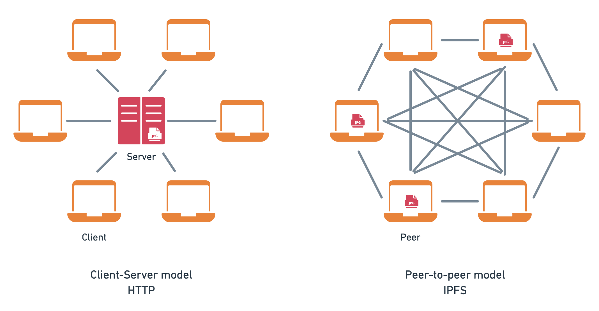
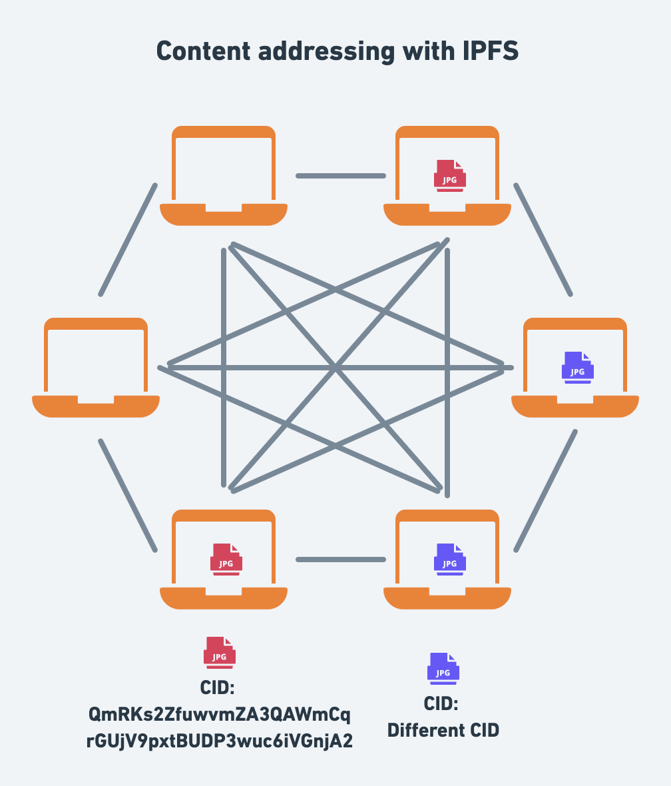

# Break on Through with IPFS HTTP Gateways

## Outline

- What is IPFS?
  - Definition
  - Concepts
    - CID
    - Peer to peer
    - Resilience - can’t be shut down
    - Easier caching with CID
  - Use-cases
    - Reading public data, e.g. NFTs
  - IPFS and the WWW
    - client-Server vs peer to peer
    - Trust
      - TLS: Certificates & encryption
      - Self verifiability
- Fetching data from IPFS
  - Low level vs high-level cloud services
    - Server, linux, nginx vs AWS S3/Cloudfront
    - IPFS Node vs Gateway
  - Fetching data from the network
    - How to use IPFS gateways
    - Public gateways
  - Resolution styles

## Intro

The Interplanetary File System (IPFS) is a peer-to-peer protocol for storing and accessing files and websites. IPFS is a distributed **peer-to-peer** protocol making it fundamentally different from the HTTP protocol that forms the foundation for the internet.

Since IPFS is a relatively new protocol compared to HTTP, native browser support for the protocol is still limited ([Brave](https://brave.com/ipfs-support/) supports it). The good news is that with the help of IPFS HTTP gateways, you can tap into the IPFS network directly from any browser.

This blog post will give a brief overview of the core concepts of the IPFS protocol, discuss the relationship between IPFS and HTTP, the role of IPFS gateways, and demonstrate how you can consume data from the IPFS network using HTTP without running any IPFS infrastructure.

If you're already familiar with the concepts of IPFS and would like to learn how to use IPFS gateways feel free to skip ahead to the [practical guide](#TODO).

## The challenges with the client-server model

Typically, when you access a website, your browser uses several protocols to load the website:

- First, DNS is used by your browser to find the IP address of the server.
- Second, HTTP is used to request the website from the server.

Such interactions are characterized by the **client-server** model whereby your browser is a client interacting with an HTTP and DNS server.

While the client-server model has been the predominant model for the internet, it is fundamentally centralized and comes at the cost of resilience, reliance on gatekeepers, and single points of failure.

Practically speaking, a common challenge with the client-server model is that it puts all responsibility to ensure the availability of content on the server operator.

For example, when you open the following [URL of an image of Astronaut Jessica Watkins](https://www.nasa.gov/sites/default/files/thumbnails/image/04_iss067e033423.jpg) from the NASA website, you rely on the NASA server(s) being up.

When the server is down or unreachable, you won’t be able to access the image.

Moreover, the HTTP protocol does not specify a way to **ask other servers** for the image so the file is only available as long as the origin server hosts it.

> Note: In reality most websites rely on multiple servers that are load balanced to ensure high availability of content. But solutions to ensure high availability are not standardised as part of the HTTP protocol and are typically opaque to clients.

## From client-server to peer-to-peer with IPFS

One of the core characteristics of the IPFS is that it is a peer-to-peer network. In contrast to the client-server model where you typically have many clients consuming from a single server, with the peer-to-peer model, every computer (typically referred to as a _peer_) in the IPFS network can wear both the hat of a server and a client. This means that every IPFS peer can become a productive member of the network.

> Note: The article uses the terms **peer** and **node** interchangeably to refer to computers running the IPFS software.

As illustrated in the diagram, instead of relying on a single server at the center of the network that clients connect to, each peer connects to multiple peers. Since the `jpg` file is stored on three of the peers, two of those three nodes can be down and the file will still be accessible to the network. What's more, any number of peers become a provider for the `jpg` file, once they download it from the network.

In summary, with IPFS, peers (computers running the IPFS software) pool their resources, e.g., internet connection and disk space, and ensure that the availability of files is **resilient** and **decentralized**.

## Location addressing vs. content addressing

In IPFS, data is **content-addressed** rather than _location-addressed_ as is common in the client-server model of the web. To understand the difference between the two approaches, let's go back to the example with the image from NASA.

In the example with the image loaded from NASA, we used location addressing to fetch the image in the form of a URL. The URL contained all the location information to find and fetch the image:

- _scheme_: the protocol `https`.
- _hostname_: DNS name `www.nasa.gov` mapped to an IP address of the server.
- _path_ to the location on the server: `/sites/default/files/thumbnails/image/04_iss067e033423.jpg`

The challenges with location addressing are numerous. We've all had the experience of going down an internet rabbit hole only to be abrupted by dead links because the link changed or the server is no longer hosting the files.

In a peer-to-peer network like IPFS, a given file might be hosted on a number of the IPFS nodes.

This is where content addressing comes in handy. With IPFS, every single file stored in the system is addressed by a cryptographic hash of its contents known as a **Content Identifier** or **CID**. The CID is a long string of letters and numbers that is unique to that file.

There are two crucial things to remember with regards to CIDs:

- Any difference in the content will produce a different CID.
- The same content added to two different IPFS nodes will produce the same CID.

The diagram illustrates what two different files look like on the network. The red jpeg represents one CID (`QmRKs2ZfuwvmZA3QAWmCqrGUjV9pxtBUDP3wuc6iVGnjA2`) hosted on two nodes, and the purple jpeg represents a different CID hosted on two other nodes.

One of the main benefits of content addressing is that you can retrieve a CID from any IPFS node as long as there's at least one node providing it to the network. So any one of the nodes could be asked for the red CID

> **Note:** Depending on the size, IPFS may split a single file into multiple blocks each with a CID of their own for efficiency reasons. Even so, the file will also have root CID. You can explore what this looks like for the NASA image using the [IPLD explorer](https://explore.ipld.io/#/explore/QmRKs2ZfuwvmZA3QAWmCqrGUjV9pxtBUDP3wuc6iVGnjA2).

## Finding files in IPFS using content addressing

In IPFS, files are retrieved

Using a peer-to-peer network has a lot of benefits discussed above, but it leaves the question of how files are found and retrieved. This is where the concept of [**content-addressing**](https://docs.ipfs.io/concepts/content-addressing/) comes in.

Content addressing is

In the client-server model, we rely on _location-addressing_ to retrieve files – URLs that point to a path on a server.

<!-- The core idea is that instead of just speaking to a single server that can be prone to network unreachability and downtime, you are connected to multiple IPFS network nodes. -->

## So why do we need gateways?

As mentioned in the beginning, browsers today mainly support the HTTP protocol. Introducing new protocols to browsers can be a lengthy process
