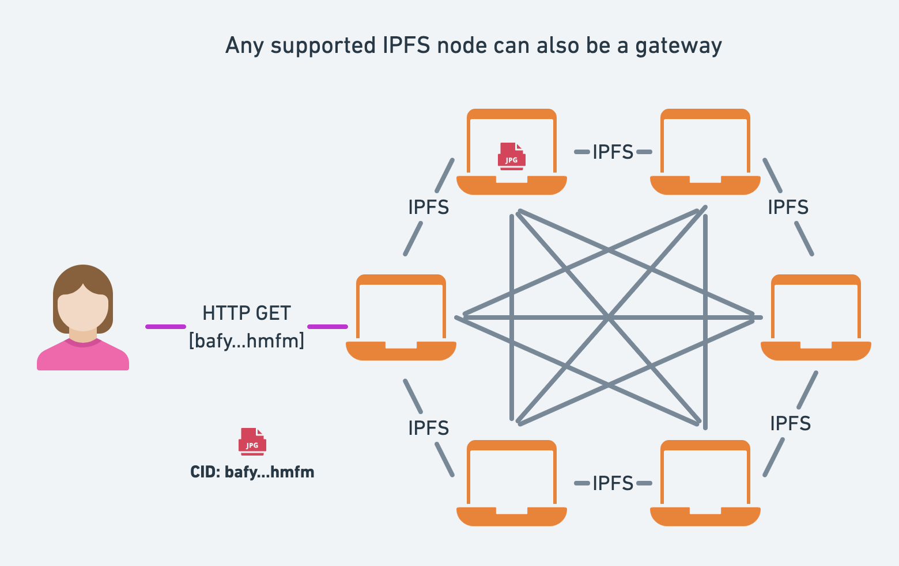

# Break on Through with IPFS HTTP Gateways

<!--

Developers fetching data [that they have stored] from IPFS.
Not necessarily operating an IPFS node — consider the situations where they’ve chosen to use Web3.storage or Pinata.

- The "any node can also be a gateway" diagram is particularly good!
- Direction wise I think what our community members have been asking for is a bit more in-depth on
- using & optimising gateways in production situations. For this piece we could slim down the pure intro a bit (and maybe save for a separate piece).

- Would it be useful to run a dedicated gateway to avoid having such errors ? or is there some other service that I can use (that you recommend) to work with IPFS. Something like PINATA (edited)

 -->

<!-- ## Outline

- What is IPFS?
  - Definition
  - Concepts
    - CID
    - Peer to peer
    - Resilience - can’t be shut down
    - Easier caching with CID
  - Use-cases
    - Reading public data, e.g. NFTs
  - IPFS and the WWW
    - client-Server vs peer to peer
    - Trust
      - TLS: Certificates & encryption
      - Self verifiability
- Fetching data from IPFS
  - Low level vs high-level cloud services
    - Server, linux, nginx vs AWS S3/Cloudfront
    - IPFS Node vs Gateway
  - Fetching data from the network
    - How to use IPFS gateways
    - Public gateways
  - Resolution styles -->

The Interplanetary File System (IPFS) is a peer-to-peer protocol for storing and accessing files and websites. As a distributed **peer-to-peer** protocol, it's fundamentally different from the HTTP protocol that forms the foundation for the internet.

<!-- Because files are at the heart of the internet and the internet is at the heart of everything, the potential use cases for IPFS are endless. -->

IPFS is a relatively new protocol compared to the time-honored HTTP protocol and isn't feasible for use in every scenario. The good news is that with the help of IPFS HTTP gateways, you can tap into the IPFS network directly from any browser.

This blog post will give an overview of the core concepts of the IPFS protocol, discuss the relationship between IPFS and HTTP(S), the role of IPFS gateways, and how you can improve the CID access performance and reliability from the IPFS network using HTTP.

If you're already familiar with the concepts of IPFS and would like to learn how to use IPFS gateways feel free to skip ahead to the [practical example](#TODO) section.

> Note: The blog post uses HTTP to refer to both HTTP and HTTPS for brevity and assumes that HTTPS should be used in every production application.

## The challenges with the client-server model

Typically, when you access a website, your browser uses several protocols to load the website:

- First, DNS is used by your browser to find the IP address of the server.
- Second, HTTP is used to request the website from the server.

Such interactions are characterized by the **client-server** model whereby your browser is a client interacting with an HTTP and DNS server.

While the client-server model has been the predominant model for the internet, it is fundamentally centralized and comes at the cost of resilience, reliance on gatekeepers, and single points of failure.

Practically speaking, a common challenge with the client-server model is that it puts all responsibility to ensure the availability of content on the server operator.

For example, when you open the following [URL of an image of Astronaut Jessica Watkins](https://www.nasa.gov/sites/default/files/thumbnails/image/04_iss067e033423.jpg) from the NASA website, you rely on AWS servers that host the NASA website.

When the servers are down or unreachable, you won’t be able to access the image.

Moreover, the HTTP protocol does not specify a way to **ask other servers** for the image; so the file is only available as long as the origin server hosts it.

> Note: In reality most websites are deployed to multiple servers that are load balanced to ensure high availability of content on one of the big cloud providers. The problem is that these high availability solutions are not standardised as part of the HTTP protocol and are opaque to clients. Moreover, the market concentration with big cloud proivder like AWS, an outage can affect thousands of [sites and services](https://www.reuters.com/markets/commodities/amazons-prime-ring-other-apps-down-thousands-users-2021-12-07/).

## From client-server to peer-to-peer with IPFS

One of the core characteristics of the IPFS is that it is a peer-to-peer network. In contrast to the client-server model where you typically have many clients consuming from a single server, with the peer-to-peer model, every computer (typically referred to as a _peer_) in the IPFS network wears both the hat of a server and a client. This means that every IPFS peer can become a productive member of the network.

> Note: The article uses the terms **peer** and **node** interchangeably to refer to computers running the IPFS software.

As illustrated in the diagram, instead of relying on a single server at the center of the network that clients connect to, each peer connects to multiple peers. Since the `jpg` file is stored on three of the peers, two of those three nodes can be down and the file will still be accessible to the network. What's more, any number of peers become a provider for the `jpg` file, once they download it from the network.

In summary, with IPFS, nodes pool their resources, e.g., internet connection and disk space, and ensure that the availability of files is **resilient** and **decentralized**.

## Location addressing vs. content addressing

In IPFS, data is **content-addressed** rather than _location-addressed_ as is common in the client-server model of the web. To understand the difference between the two approaches, let's go back to the example with the image from NASA.

In the example with the image loaded from NASA, we used location addressing to fetch the image in the form of a URL. The URL contained all the location information to find and fetch the image:

- _scheme_: the protocol `https`.
- _hostname_: DNS name `www.nasa.gov` mapped to an IP address of the server.
- _path_ to the location on the server: `/sites/default/files/thumbnails/image/04_iss067e033423.jpg`

The challenges with location addressing are numerous. We've all had the experience of going down an internet rabbit hole only to be abrupted by dead links because the link changed or the server is no longer hosting the files.

In a peer-to-peer network like IPFS, a given file might be hosted on a number of the IPFS nodes.

This is where _content addressing_ comes in handy. With IPFS, every single file stored in the system is addressed by a [cryptographic hash](https://en.wikipedia.org/wiki/Cryptographic_hash_function) of its contents known as a [**Content Identifier** or **CID**](https://docs.ipfs.io/concepts/glossary/#cid). The CID is a long string of letters and numbers that is unique to that file.

There are three crucial things to remember with regards to CIDs:

- Any difference –even a single bit– to the file (or file tree in the case of a folder) will produce a different CID. This property is known as **immutability**.
- The same content added to two different IPFS nodes will produce the same CID (given the same parameters).
- A single CID can represent a single file or a folder of files, e.g. a static website. This property is known as "[turtles all the way down](https://en.wikipedia.org/wiki/Turtles_all_the_way_down)".

The diagram illustrates what two different files look like on the network. The red jpeg represents one CID hosted on two nodes, while the purple jpeg represents a different CID hosted on two other nodes.

> **Note:** Depending on the size, IPFS may chunk (split) a single file into multiple blocks each with a CID of their own for efficiency reasons. Even so, the file will also have root CID. You can explore what this looks like for the NASA image using the [IPLD explorer](https://explore.ipld.io/#/explore/bafybeibml5uieyxa5tufngvg7fgwbkwvlsuntwbxgtskoqynbt7wlchmfm).

### You can ask any IPFS node for a CID

One of the benefits of content addressing is that you can retrieve a CID from any IPFS node as long as there's at least one node providing it to the network.

For example, if you ask an IPFS node for a CID that it doesn't have, the node can search the IPFS network, and if it finds another reachable IPFS node hosting the CID, it can fetch it and serve it back to you.

## Speaking IPFS

It's worth noting that IPFS is a set of open-source protocols, specifications, and software implementations.

So how do you use IPFS to access files in real-world applications?

There are two prominent ways to fetch files stored in the IPFS network:

- Running an IPFS node by installing one of the IPFS implementations as a daemon (long-running process) on your computer or on a server in the cloud. The node becomes a member of the IPFS peer-to-peer network and announces what data it’s holding and responds to requests for data.
- Using an **IPFS Gateway** which allows fetching CIDs using the HTTP protocol.

The first option allows you to _speak the native IPFS protocol_ while the latter serves as a bridge in situations where you might be constrained to using HTTP. Choosing the right approach depends on your use case.

## What are IPFS gateways?

IPFS gateways are public services that translate between _Web2_ and _Web3_ thereby providing a bridge between HTTP and IPFS.

They allow you to use the HTTP protocol –which almost every programming language is capable of– to request a CID from the IPFS network, fetch it, and use HTTP to send the data back.

In its simplest form, a gateway is an IPFS node that also accepts HTTP requests for CIDs in addition to speaking the IPFS protocol to participate in the peer-to-peer network. Most IPFS implementations can also work as a gateway.

<!-- Some browsers such as Brave and [Opera](https://blogs.opera.com/tips-and-tricks/2021/02/opera-crypto-files-for-keeps-ipfs-unstoppable-domains/) and introducing new protocols to browsers can be a lengthy process. This is where IPFS Gateways come in handy. -->

## How to use IPFS gateways

To use an IPFS gateway, you need to know two things:

- The CID (Content Identifier), e.g. `bafybeibml5uieyxa5tufngvg7fgwbkwvlsuntwbxgtskoqynbt7wlchmfm`
- The address of the IPFS gateway

### Resolution style

The **resolution style** refers to how you construct a URL for a given CID.

Depending on your use case you can choose from one of two resolution styles.:

- **Path resolution** where the CID is in the path portion of the gateway URL, e.g. https://ipfs.io/ipfs/bafybeibml5uieyxa5tufngvg7fgwbkwvlsuntwbxgtskoqynbt7wlchmfm
- **Subdomain resolution** where the CID is in the host portion of the URL, as a subdomain of the gateway host, e.g., https://bafybeibml5uieyxa5tufngvg7fgwbkwvlsuntwbxgtskoqynbt7wlchmfm.ipfs.dweb.link

Subdomain resolution is the recommended style for serving content over HTTP gateways, especially if you're using IPFS to host websites and applications. This is because web browsers provide security isolation on a per-domain basis (See [Same-origin policy](https://developer.mozilla.org/en-US/docs/Web/Security/Same-origin_policy) for more).

With the subdomain style, every CID subdomain gets its own "namespace" for things like cookies and local storage, which isolates things from other web content stored on IPFS.

If a CID points to a directory listing as in the case of a website, you can use the path portion of the URL to specify the filename. For example, below is the URL for one of the images on the IPFS website:

https://bafybeih42hd2kjcr7o2f72jinvwotlfn24hppwnfl34lku3665cyp4gipe.ipfs.dweb.link/images/command-line-hex.png

If you remove the path, from the URL you will get the root of a recent version of the IPFS website (remember, CIDs are immutable so every change to the IPFS website creates a new CID)

### Public gateways

Public gateways as the name suggests are IPFS gateways that allow anyone to use HTTP to fetch CIDs from the IPFS network.

You can find public gateway operators in the [public gateway checker](https://ipfs.github.io/public-gateway-checker/) and check whether they are online and the latency from your location.

Beware that many of the public gateways are provided on a best-effort basis without any SLA. Follow along on how to ensure the reliable availability of your content.

To demonstrate using a public gateway, open one of the URLs below of an image of Astronaut Jessica Watkins from the first example, which was originally hosted on the NASA servers and has been uploaded to the IPFS network, the corresponding CID for the image is `bafybeibml5uieyxa5tufngvg7fgwbkwvlsuntwbxgtskoqynbt7wlchmfm`.

- https://bafybeibml5uieyxa5tufngvg7fgwbkwvlsuntwbxgtskoqynbt7wlchmfm.ipfs.infura-ipfs.io
- https://bafybeibml5uieyxa5tufngvg7fgwbkwvlsuntwbxgtskoqynbt7wlchmfm.ipfs.dweb.link
- https://bafybeibml5uieyxa5tufngvg7fgwbkwvlsuntwbxgtskoqynbt7wlchmfm.ipfs.cf-ipfs.com
<!-- removed as it races - https://bafybeibml5uieyxa5tufngvg7fgwbkwvlsuntwbxgtskoqynbt7wlchmfm.ipfs.nftstorage.link -->

If you opened more than one of the gateway links, you may have noticed that they had different loading times. **This is because some gateways might not have the CID cached locally, so they have to ask the network and fetch the file from another IPFS node to serve your HTTP request.**

This means if your CID isn't well replicated in the IPFS network, fetching a CID from a gateway can take anywhere between milliseconds to the order of tens of seconds – obviously suboptimal if you're building an app that requires fast loading times.

In the next part, you will learn about some approaches to improve CID request latency and ensure reliable access to your CIDs when using IPFS gateways.

## Improving performance and reliability when fetching CIDs from IPFS

Given the decentralized nature of IPFS, improving the reliability and request latency of your CIDs through an IPFS gateway depends on many factors:

- Whether the IPFS gateway has the CID cached.
- Which gateway you are requesting the CID from?
- The amount of traffic and load on the IPFS gateway
- The number of IPFS nodes **pinning** the CID.
- Is there a [CDN](https://en.wikipedia.org/wiki/Content_delivery_network) in front of the IPFS gateway?
- The network distance (round-trip time) between the requester and the IPFS gateway.
- [HTTP Cache](https://developer.mozilla.org/en-US/docs/Web/HTTP/Caching) headers

Taking all these into consideration makes it hard to give generic advice. Nonetheless, understanding the factors influencing the performance can help you navigate the space of potential solutions.

Some are these factors are within your control. The section below will cover some concrete tips you can take to improve performance and reliability. But first, let's go into the subtle differences between pinning.

### Caching vs. pinning

As mentioned earlier, an IPFS gateway in its simplest form is an IPFS node with its HTTP gateway port open. When you request a CID, it will be returned quickly if the IPFS node has the CID cached or pinned. If not, it has to search the network.

IPFS has a fairly aggressive caching mechanism that will keep an object local for a short time after the node has fetched it from the network, but these objects may get garbage-collected regularly.

Pinning is the mechanism that allows you to tell IPFS to **always** store a given CID — by the default on your local node. In addition to local pinning, you can also pin your CIDs to [remote pinning services](https://docs.ipfs.io/how-to/work-with-pinning-services/).

In other words, caching is the mechanism by which CID is kept around on the node for a short period until garbage-collected while pinning is a deliberate choice you make to keep the CID stored on the node.

This is why requesting a CID for the first time from a gateway can take time while subsequent requests are typically faster.

### Tip 1: Pin your CIDs to multiple IPFS nodes

Drawing on the principles laid out above, it's sensible to pin your CIDs to multiple IPFS nodes to ensure reliable availability and fast fetching. These can be either IPFS nodes that you are operating or pinning services like [Web3.storage](https://web3.storage/), [Pinata](https://www.pinata.cloud/), and [Infura](https://infura.io/product/ipfs).

To make pinning easier, there's a [Pinning Service API Spec](https://ipfs.github.io/pinning-services-api-spec/) that is already supported by IPFS node implementations, client libraries, and pinning services. Using this spec, you can implement pinning to multiple services as part of your workflow for uploading immutable data to IPFS.

Note that pinning is not the same as adding the CID to the IPFS network. For pinning to work, the CID has to first be added to a reachable IPFS node connected to the network so that the pinning services can replicate the CID. All of the pinning services also offer an API for uploading a file that returns the CID.

If you're not running an IPFS node, you can start by uploading a file to one service and then using the returned CID to pin it to other services.

### Tip 2: Use a custom domain that you control as your IPFS gateway

Imagine the following scenario: you deploy your web app to IPFS which contains media with absolute URLs to a public gateway experiencing an outage. For example, your web app displays the image with an absolute path to the CID: https://bafybeibml5uieyxa5tufngvg7fgwbkwvlsuntwbxgtskoqynbt7wlchmfm.ipfs.infura-ipfs.io.

You may be able to reach your app using a different gateway, but since the web app's content is immutable, the image pointing to the Infura IPFS gateway which is down will not load.

For this reason, it's sensible to use a domain within your control to route HTTP traffic to a gateway. This approach potentially gives you the flexibility to implement additional performance optimizations.

Practically speaking, this can be implemented using several approaches depending on your willingness to run infrastructure:

- Point a domain you control, e.g., `*.ipfs.yourdomain.io` point to a reverse proxy like nginx which will proxy requests to a public gateway, allowing you to switch public gateways if there's downtime.
- Use [Cloudflare workers](https://workers.cloudflare.com/) to implement a smart proxy that races a request across multiple gateways. This is the approach taken by the [NFT.storage gateway](https://nft.storage/docs/concepts/gateways/#architecture) for which you can find the [source code on GitHub](https://github.com/nftstorage/nftstorage.link/tree/main/packages/edge-gateway#high-level-architecture).

<!-- ### Tip 3: Make use of the  and etag headers -->

### Tips if you're running an IPFS node

- Explicitly peer with the pinning services that you use and public gateways
- Ensure that you are correctly returning HTTP cache headers to the client if the node is behind a reverse-proxy
- Put a CDN like Cloudflare in front to reduce load on the IPFS node

<!-- Caching plays a big role in gateway performance. I think some of the pinning service providers offer caching as a paid service, but I can’t recall the exact latest details.

Example: NFT.storage has a new gateway that improves retrieval performance: nftstorage.link. This gateway “races” 3 public gateways (Pinata, Cloudflare, and ipfs.io) and also caches the majority of NFTs (>70% of them).
Individually, each gateway takes ~500ms-1.5s. Combining the racing + caching, overall performance on the NFTStorage gateway ends up being ~200ms.
More info:
https://nft.storage/blog/post/2022-03-08-gateway-release/
https://nft.storage/docs/concepts/gateways/#the-nftstorage-gateway
This is not helpful for the specific pathway you’re investigating (local node > public gateway), alas. But it is probably helpful in thinking about overall tradeoffs. (edited)
 -->
<!--
### considerations for apps

- Loading time can vary depending on availability.

> Lidel: where performance matters, add logic that "prewarms" HTTP CDNs/cache, and make sure etag and cache-control headers returned by http gateway are not lost. when go-ipfs 0.13 or later is used, leverage `X-Ipfs-Roots` header for even smarter HTTP cache invalidation. -->

## Summary

TODO
